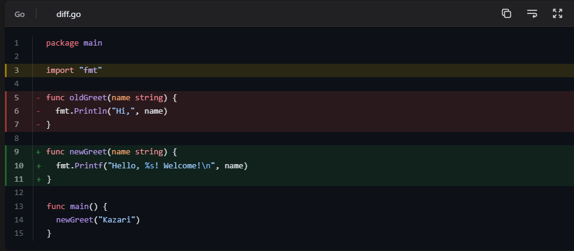

<p align="center">
  
</p>

<h1 align="center">Kazari</h1>

<p align="center">
  <a href="https://pkg.go.dev/github.com/frostybee/kazari"></a>
  <a href="LICENSE"></a>
  
</p>

Kazari (飾り, "decoration") is a Go library that renders framed, syntax-highlighted HTML code blocks. It wraps [Nuri](https://github.com/frostybee/nuri) (a pure Go Shiki port) or [Chroma](https://github.com/alecthomas/chroma) for tokenization and adds the presentation layer on top: editor and terminal frames, line markers, copy buttons, collapsible sections, dual-theme support, and 90+ CSS variables for styling. Think [Expressive Code](https://expressive-code.com/), but for Go.

Nuri and Chroma give you colored tokens, but not a finished code block. Kazari bridges that gap. Pass code and a meta string to `engine.Render()`, get back self-contained HTML. `engine.CSS()` and `engine.JS()` return the page-wide stylesheet and scripts to inject once. Everything renders server-side with no framework dependency.

<p align="center">
  
  <br>
  <em>A framed, syntax-highlighted code block rendered by Kazari with diff markers, line highlights, line numbers, copy, word wrap, and fullscreen buttons.</em>
</p>

## Features

**Frames and chrome**
- Editor and terminal frames (macOS-style dots, colored or minimal)
- Automatic frame detection: shell languages get terminal frames
- Title bars with file icons and language badges
- File name extraction from code comments (`// config.go` becomes the title)
- Copy-to-clipboard, word wrap toggle, fullscreen with font size controls
- Per-block theme toggle (light/dark independent of the page theme)

**Markers and annotations**
- Line markers: highlight, insertion, deletion with colored backgrounds and border accents
- Labeled line ranges (`{"API":3-7}`)
- Inline text and regex markers
- Focus lines (dim everything except the focused range)
- Diff+syntax hybrid: `diff lang=go` strips prefixes, applies ins/del markers, highlights as Go
- Inline links: `@[text](url)` renders clickable links inside code

**Collapsible sections**
- Threshold-based: auto-collapse blocks exceeding N lines with a preview and expand button
- Range-based: collapse specific line ranges with `collapse={3-10}`
- Four collapse styles: github, collapsible-start, collapsible-end, collapsible-auto

**Themes**
- Dual-theme rendering: light and dark token colors baked into HTML via CSS custom properties
- Theme switching is pure CSS. No JS, no flash on toggle or page load
- Per-block theme override via meta string (`theme="catppuccin-mocha"`)
- Dark mode via CSS class selector, `prefers-color-scheme`, or both
- OKLCH-based theme color adjustments (hue/chroma tinting)

**Accessibility**
- Automatic WCAG contrast enforcement: token colors adjusted per-token to meet a configurable minimum ratio (default 5.5:1)
- ARIA labels, live regions, screen reader announcements
- `all: revert` style reset isolates blocks from page CSS

**Integration**
- Goldmark extension for markdown rendering
- `:::code-group` tabbed containers with tab sync
- Mermaid pass-through
- ANSI escape sequence rendering
- i18n: en-US, fr-FR, ja-JP with per-string overrides

## Install

```bash
go get github.com/frostybee/kazari@latest
```

Kazari requires a highlighter. For Nuri (recommended):

```bash
go get github.com/frostybee/nuri@latest
```

Or for Chroma:

```bash
go get github.com/alecthomas/chroma/v2@latest
```

## Quick start

### Render a code block

```go
package main

import (
    "context"
    "fmt"

    "github.com/frostybee/kazari"
    kazarinuri "github.com/frostybee/kazari/nuri"
    "github.com/frostybee/nuri"
    "github.com/frostybee/nuri/bundle/core"
)

func main() {
    ctx := context.Background()
    hl, _ := nuri.New(ctx, nuri.WithFS(core.FS()))
    defer hl.Close(ctx)

    engine := kazari.New(
        kazari.WithHighlighter(kazarinuri.New(ctx, hl)),
        kazari.WithThemes("github-light", "github-dark"),
    )

    code := `func main() {
    fmt.Println("hello")
}`
    html, _ := engine.RenderWithMeta(code, `go title="main.go" showLineNumbers {2}`)

    fmt.Println(engine.CSS()) // inject once in <head>
    fmt.Println(html)         // per code block
    fmt.Println(engine.JS())  // inject once before </body>
}
```

`engine.CSS()` and `engine.JS()` return page-wide assets. Inject each once. `engine.Render()` / `engine.RenderWithMeta()` return per-block HTML.

### With Goldmark

```go
import (
    kazarimd "github.com/frostybee/kazari/goldmark"
    "github.com/yuin/goldmark"
)

md := goldmark.New(
    goldmark.WithExtensions(kazarimd.New(engine)),
)

// For code group support (:::code-group):
md := goldmark.New(
    goldmark.WithExtensions(
        kazarimd.New(engine),
        kazarimd.CodeGroups(engine),
    ),
)
```

### With Chroma

```go
import kazarichroma "github.com/frostybee/kazari/chroma"

hl := kazarichroma.New(kazarichroma.WithStyleMap(map[string]string{
    "github-light": "github",
    "github-dark":  "github-dark",
}))

engine := kazari.New(
    kazari.WithHighlighter(hl),
    kazari.WithThemes("github-light", "github-dark"),
)
```

## Configuration

Kazari has three configuration layers. Each overrides the previous:

1. **Engine options** set once at construction via `kazari.New()`
2. **Config file** (`kazari.config.yaml`) loaded with `kazari.WithConfigDir()`
3. **Meta string** for per-block overrides in the markdown fence info string (highest priority)

### Engine options

```go
engine := kazari.New(
    kazari.WithHighlighter(hl),
    kazari.WithThemes("github-light", "github-dark"),
    kazari.WithDarkMode(kazari.SelectorMode(".dark")),
    kazari.WithCopyButton(true),
    kazari.WithFullscreenButton(true),
    kazari.WithWrapButton(true),
    kazari.WithLineNumbers(true),
    kazari.WithCollapsible(kazari.CollapsibleConfig{
        LineThreshold:    15,
        PreviewLines:     5,
        DefaultCollapsed: true,
    }),
    kazari.WithMinContrast(5.5),
    kazari.WithMinify(true),
    kazari.WithLocale("en-US"),
)
```

See `options.go` and `features.go` for the full list of `With*` options.

### Config file

Create `kazari.config.yaml` (or `.json`) in the project directory:

```yaml
themes:
  light: github-light
  dark: github-dark
darkMode:
  kind: selector
  selector: ".dark"
copyButton: true
fullscreenButton: true
lineNumbers: false
collapsible:
  lineThreshold: 15
  previewLines: 5
languageDefaults:
  bash,sh,zsh:
    frame: terminal
styleOverrides:
  --kz-radius: "0.75rem"
  --kz-font-size: "0.85rem"
```

Load it as an engine option:

```go
engine := kazari.New(
    kazari.WithHighlighter(hl),
    kazari.WithConfigDir("."),
)
```

### Meta string

Per-block overrides go after the language in the opening fence:

````
```go title="main.go" showLineNumbers {2, 4-6}
````

| Key | Example | Effect |
|---|---|---|
| `title="..."` | `title="config.go"` | Title bar text |
| `showLineNumbers` | | Enable line numbers |
| `startLineNumber=N` | `startLineNumber=10` | First line number |
| `frame=` | `frame=terminal` | `code`, `terminal`, `none`, `auto` |
| `theme="..."` | `theme="dracula"` | Per-block theme override |
| `wrap` | | Enable word wrap |
| `{N}` or `{N-M}` | `{3, 5-8}` | Highlight lines |
| `{"Label":N-M}` | `{"API":3-7}` | Labeled highlight |
| `ins={N-M}` | `ins={3-5}` | Insertion markers |
| `del={N-M}` | `del={1}` | Deletion markers |
| `ins="text"` | `ins="new"` | Inline insertion marker |
| `del="text"` | `del="old"` | Inline deletion marker |
| `"text"` | `"highlight"` | Inline highlight marker |
| `/regex/` | `/fmt\.\w+/` | Regex inline marker |
| `focus={N-M}` | `focus={3-5}` | Focus lines (dim the rest) |
| `collapse` | | Force collapse |
| `nocollapse` | | Disable collapse |
| `collapse={N-M}` | `collapse={5-15}` | Collapse specific range |
| `collapseThreshold=N` | `collapseThreshold=20` | Per-block threshold |
| `lang=` | `lang=go` (on `diff`) | Diff+syntax hybrid |

### CSS variables

All visual properties are controlled through `--kz-*` CSS custom properties (90+ variables). Override them in a stylesheet:

```css
:root {
  --kz-radius: 0.75rem;
  --kz-font-size: 0.85rem;
  --kz-font-family: 'Fira Code', monospace;
  --kz-code-padding-block: 1.25rem;
  --kz-mark-bg: rgba(255, 200, 0, 0.15);
}
```

Or pass them as engine options:

```go
kazari.WithStyleOverrides(map[string]string{
    "--kz-radius": "0.75rem",
})

kazari.WithThemedStyleOverrides(map[string]kazari.StyleValue{
    "--kz-radius": {Light: "0.75rem", Dark: "0.5rem"},
})
```

### Pluggable highlighter

Kazari accepts any implementation of its `Highlighter` interface:

```go
type Highlighter interface {
    Tokenize(code, lang, theme string) ([][]Token, error)
    GetThemeColors(theme string) (ThemeInfo, error)
    GetLoadedLanguages() []string
}
```

Adapters for Nuri and Chroma are provided in `kazari/nuri` and `kazari/chroma`. Implement the optional `DualThemeTokenizer` interface to halve dual-theme tokenization cost.

## Development

### Build and test

```bash
go build ./...
go test ./...
go test -v -run TestRender ./...
```

### Demo site

The demo site generates pages comparing Nuri and Chroma output, a color contrast correction demo, and a performance benchmark.

```bash
cd demo/site && go run .
```

Output is written to `demo/site/` (nuri-vs-shiki.html, nuri-vs-chroma.html, color-contrast.html, benchmark.html).

## Contributing

1. Fork and create a feature branch.
2. Run `go test ./...` before submitting.
3. Keep changes focused. One feature or fix per PR.

Questions and bug reports go to [GitHub Issues](https://github.com/frostybee/kazari/issues).

## Acknowledgments

Kazari is inspired by [Expressive Code](https://expressive-code.com/) and brings its feature set to the Go ecosystem. The HTML structure, CSS patterns, and class conventions are derived from Expressive Code by Hippo ([MIT License](https://github.com/expressive-code/expressive-code/blob/main/LICENSE)).

## License

Copyright (c) 2026 FrostyBee.

Kazari is licensed under the [MIT License](LICENSE). Kazari embeds CSS and JS patterns derived from Expressive Code (MIT). See [THIRD-PARTY-NOTICE](THIRD-PARTY-NOTICE) for full attribution.

---

Full API documentation: [pkg.go.dev/github.com/frostybee/kazari](https://pkg.go.dev/github.com/frostybee/kazari)
