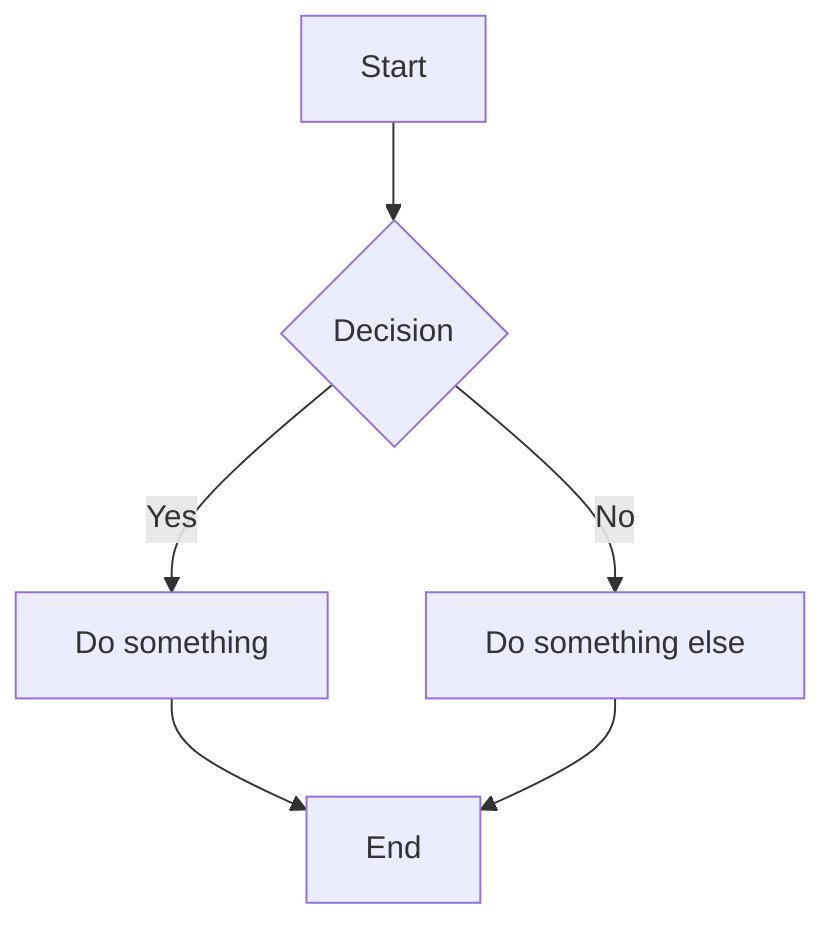

Mermaid pass-through emits a `lang="mermaid"` block as a raw `<pre class="mermaid">` element without any Kazari processing. A client-side Mermaid.js script selects that element and replaces it with a rendered SVG diagram.

## Usage

Use `mermaid` as the language identifier in the fence:

````

````

→ Kazari emits a raw `<pre class="mermaid">` element with HTML-escaped content. No frame, toolbar, copy button, or line numbers are rendered.

Special characters such as `>` become `&gt;`. The block bypasses all Kazari preprocessing.

## Client-side setup

Load Mermaid.js once per page, after the content:

```html
<script type="module">
  import mermaid from 'https://cdn.jsdelivr.net/npm/mermaid/dist/mermaid.esm.min.mjs'
  mermaid.initialize({ startOnLoad: true })
</script>
```

Mermaid.js selects all `.mermaid` elements on load and replaces each with an inline SVG. Kazari produces no CSS and no JS for mermaid blocks.

## Disabling pass-through

To render mermaid blocks as ordinary Kazari code blocks (with frame, toolbar, and syntax coloring), disable pass-through at engine construction:

```go
engine := kazari.New(
    kazari.WithHighlighter(hl),
    kazari.WithMermaidPassThrough(false),
)
```

With pass-through disabled, `lang="mermaid"` blocks are highlighted as plain text using the configured highlighter and wrapped in the standard Kazari frame.

## Configuration

| Option | Layer | Default | Description |
|---|---|---|---|
| `WithMermaidPassThrough(bool)` | Go API | `true` | Enable or disable mermaid pass-through |
| `mermaidPassThrough` | Config file | `true` | YAML/JSON equivalent |

Pass-through is on by default. There are no mermaid-specific meta string keys. Standard meta string options such as `title=` have no effect on mermaid blocks because Kazari returns the raw `<pre>` element before meta string processing can influence the output.

## Edge cases

- Pass-through is on by default. Set `WithMermaidPassThrough(false)` to render mermaid as a standard code block.
- All Kazari features are bypassed: no frame, toolbar, copy button, line numbers, markers, collapsible sections, or output panel.
- Post-render callbacks registered via `WithPostRender` are not invoked for mermaid blocks.
- Meta string options are parsed but discarded. Options like `title=` or `showLineNumbers` have no effect.
- Mermaid pass-through works transparently through the Goldmark extension. No special handling is needed.
- Language matching is case-insensitive. `Mermaid`, `MERMAID`, and `mermaid` all trigger pass-through.
