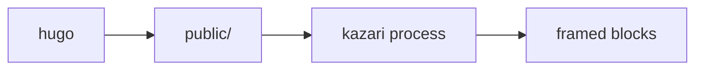

## A plain fence

No options at all. The language comes from the fence, the frame is chosen
automatically, and line numbers come from `defaults.lineNumbers` in
`kazari.config.yaml`.

```go
package main

import "fmt"

func main() {
	fmt.Println("hello")
}
```

## A title

`title` puts a name in the toolbar, after the language badge and its
separator. The icon at the far left of the badge is an empty span that
Kazari emits and this site fills from `static/site.css`, since Kazari
ships no icon art of its own.

```go {title="server.go"}
package main

import "net/http"

func main() {
	http.ListenAndServe(":8080", nil)
}
```

## A title from the code itself

With no `title` attribute, a file name in the first line comment becomes
the title and the comment is removed from the rendered code. This needs no
render hook, so it works on any Hugo site.

```js
// app/routes.js
export function register(app) {
  app.get("/health", (req, res) => res.send("ok"));
}
```

## Line numbers off, and a different start

`showlinenumbers="false"` overrides the site default for one block.
`startlinenumber` renumbers an excerpt to match its source file.

```go {showlinenumbers="false"}
type Config struct {
	Addr string
	TLS  bool
}
```

```go {title="handler.go" startlinenumber="42"}
func handle(w http.ResponseWriter, r *http.Request) {
	if r.Method != http.MethodGet {
		w.WriteHeader(http.StatusMethodNotAllowed)
		return
	}
	w.Write([]byte("ok"))
}
```

## Terminal frames

Shell languages get a terminal frame automatically, with no attribute
needed.

```bash
go build ./...
kazari process public
```

A title names the terminal window without changing the frame.

```bash {title="Release checklist"}
hugo --minify
kazari process --config kazari.config.yaml public
rsync -a public/ deploy@example.org:/srv/www/
```

## When a shell block is a file

Detection looks at the code, not at the title. A shebang or a file name
comment in the first few lines means the block is a script file rather
than a session, so it gets an editor frame instead.

```bash {title="deploy.sh"}
#!/usr/bin/env bash
set -euo pipefail
hugo --minify
kazari process --config kazari.config.yaml public
```

## Forcing a frame

`frame` overrides detection entirely. `frame="terminal"` puts the window
chrome back on the script above, `frame="code"` does the reverse, and
`frame="none"` drops the chrome and leaves the highlighted code on its
own.

```bash {frame="terminal" title="deploy.sh"}
#!/usr/bin/env bash
set -euo pipefail
hugo --minify
```

```bash {frame="none"}
curl -sSfL https://example.org/install.sh | sh
```

## Wrapping long lines

`wrap="true"` soft wraps instead of scrolling sideways.
`hangingindent="4"` indents the continuation of a wrapped line so it stays
visually attached to the line it belongs to.

```text {wrap="true" hangingindent="4" showlinenumbers="false"}
ERROR failed to reconcile deployment "api-gateway" in namespace "production": admission webhook "validate.example.org" denied the request: container "gateway" must declare a memory limit
```

## Mermaid stays untouched

Mermaid fences pass straight through. The processor recognises them and
leaves the block alone so a diagram renderer on the page can claim it.


